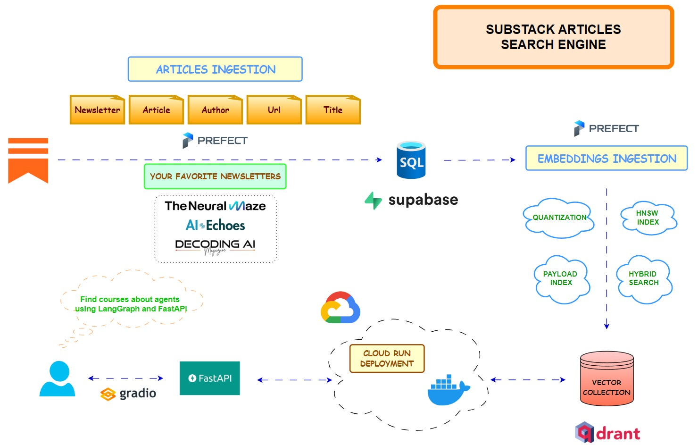
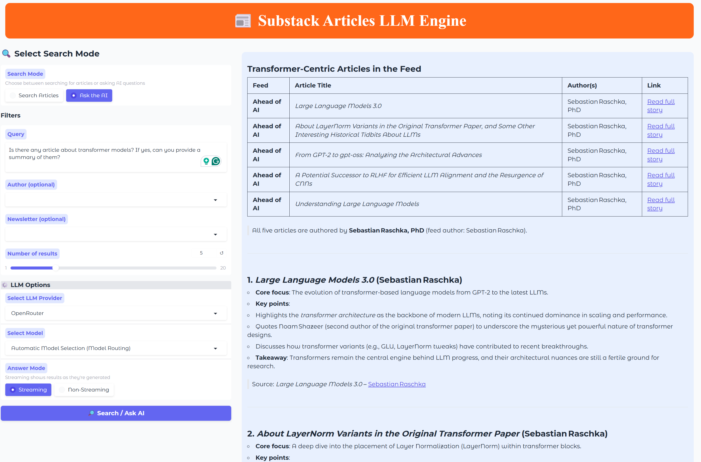

# Substack Articles Search Engine

<!-- Project Status -->

<!-- Providers -->

  <em>A RAG application for searching articles and getting answers on relevant topics from your favorite Substack newsletters</em>

## 📚 Table of Contents

- [Substack Articles Search Engine](#substack-articles-search-engine)
  - [📚 Table of Contents](#-table-of-contents)
  - [🙂 Contributors](#-contributors)
  - [🎯 Why Take This Course?](#-why-take-this-course)
  - [👥 Who Is This Course For?](#-who-is-this-course-for)
  - [🧑‍🎓 What You Will Learn](#-what-you-will-learn)
  - [🎓 Prerequisites](#-prerequisites)
  - [💵 Does this course cost anything?](#-does-this-course-cost-anything)
  - [📚 Course Outline](#-course-outline)
  - [🚀 Getting Started](#-getting-started)
  - [🔌 Services Providers](#-services-providers)
  - [🪪 License](#-license)
  
## 🙂 Contributors

<table>
  <tr>
    <td align="center"></td>
    <td>
      <strong>Benito Martin | AI / ML Engineer </strong> 
      <a href="https://www.linkedin.com/in/benitomartin/">LinkedIn</a> 
      <a href="https://aiechoes.substack.com/">AI Echoes Newsletter</a> 
    </td>
  </tr>
  <tr>
    <td align="center"></td>
    <td>
      <strong>Miguel Otero Pedrido | AI / ML Engineer </strong> 
      <a href="https://www.linkedin.com/in/migueloteropedrido/">LinkedIn</a> 
      <a href="https://www.youtube.com/@TheNeuralMaze">YouTube</a> 
      <a href="https://theneuralmaze.substack.com/">The Neural Maze Newsletter</a>
    </td>
  </tr>

</table>

## 🎯 Why Take This Course?

Unlike basic tutorials, this course provides a comprehensive, hands-on guide to building a complete end-to-end Retrieval-Augmented Generation (RAG) system using modern tools and best practices. You’ll see how to:

- Automate data pipelines for ingesting and processing newsletter content
- Integrate multiple cloud and open-source services (Supabase, Qdrant, Prefect, FastAPI)
- Build a robust backend for keyword and LLM-powered search
- Deploy and interact with your system using Google Cloud, a Gradio UI and REST API

## 👥 Who Is This Course For?

| Audience              | Why Join?                                             |
|-----------------------|-------------------------------------------------------|
| ML/AI Engineers       | Build scalable RAG and LLM-powered search systems     |
| Software Engineers    | Learn modern backend, API, and cloud deployment skills|
| Data Engineers        | Automate data pipelines and vector search workflows   |
| AI Enthusiasts        | Get hands-on with real-world, production-grade tools  |

## 🧑‍🎓 What You Will Learn

By the end of this course, you will have a fully functional RAG system and the skills to build production-ready applications to search over your favorite newsletters. You will:

- Ingest articles from RSS feeds and store them in Supabase
- Generate and index embeddings in Qdrant, including payload indexes for filtering with optimized index configuration with quantization and hybrid search
- Orchestrate and schedule workflows with Prefect (local and cloud)
- Build and expose RESTful search endpoints using FastAPI
- Integrate multiple LLM providers (OpenRouter, OpenAI, Hugging Face)
- Deploy your backend to Google Cloud Run for global access
- Create an interactive Gradio UI for end-users

## 🎓 Prerequisites

- Python (Intermediate)
- Basic understanding of REST APIs
- Familiarity with AI/LLM concepts is helpful
- Modern laptop/PC (no GPU required; free tiers are sufficient)

## 💵 Does this course cost anything?

- No, this course is completely free to access and learn from. Starring and sharing the repository is appreciated!
- Google Cloud Run monthly free tier is sufficient for deployment
- Prefect cloud monthly free tier is sufficient for orchestration once your flow is deployed but it is recommended to use prefect local server for development as it is unlimited.
- Supabase and Qdrant monthly free tiers are sufficient for hosting the Postgres and vector databases
- OpenRouter daily requests on free LLM models is sufficient for LLM calls but you can also use OpenAI or Hugging Face as backup LLM providers as the project supports multiple LLM providers.
- Any other tools used in this course like FastAPI, Docker, Gradio, or Opik are completely free to use.

## 📚 Course Outline

| Lesson | Topic                                                        | Substack Article                 | Description                                             |
|--------|--------------------------------------------------------------|--------------------------------|---------------------------------------------------------|
| 1      | Setup, Configuration & Articles Ingestion                    | [Lesson 1](https://aiechoes.substack.com/p/building-a-substack-articles-search)          | Supabase Postgres setup and ingesting articles           |
| 2      | Vector Embeddings & Semantic Search Infrastructure           | [Lesson 2](https://aiechoes.substack.com/p/building-a-substack-articles-search-6d1)        | Qdrant configuration and semantic search                 |
| 3      | FastAPI Backend & Multi-Provider LLM Support                 | [Lesson 3](https://aiechoes.substack.com/p/building-a-substack-articles-search-9dd)        | FastAPI backend, OpenRouter, OpenAI, Hugging Face        |
| 4      | Cloud Run Deployment & Gradio UI                             | [Lesson 4](https://aiechoes.substack.com/p/building-a-substack-articles-search-21a)          | Google Cloud Run deployment and Gradio UI                |
| 5      | Video Application Overview                                                   | [Lesson 5](https://theneuralmaze.substack.com/p/how-to-build-production-ready-rag)                | Video demo showcasing the entire pipeline                 |

## 🚀 Getting Started

Follow the [INSTRUCTIONS.md](INSTRUCTIONS.md) in the documentation to set up your environment, install dependencies, and configure services.

All components are explained in detail in the documentation but if you have any questions, feel free to open an issue or reach out!

## 🔌 Services Providers

This project integrates several best-in-class open-source and cloud services to provide a scalable, production-ready RAG pipeline:

| Service  | Description                           | Docs/Links                                                                  |
| -------- | ------------------------------------- | --------------------------------------------------------------------------- |
| Supabase | PostgreSQL database for articles      | [Supabase](https://supabase.com/docs)                                       |
| Qdrant   | Vector DB for embeddings              | [Qdrant](https://qdrant.tech/documentation/database-tutorials/bulk-upload/) |
| Prefect  | Orchestration for ingestion/embedding | [Prefect](https://docs.prefect.io/)                                         |
| OpenRouter                                    | LLM Provider                        | [OpenRouter](https://www.openrouter.com/)                                   |
| OpenAI, Hugging Face (backup)                 | LLM Provider (backup)               | [OpenAI](https://platform.openai.com/docs/) / [Hugging Face](https://huggingface.co/docs) |
| Docker   | Containerization                      | [Docker](https://docs.docker.com/)                                          |
| FastAPI  | API for querying/search               | [FastAPI](https://fastapi.tiangolo.com/)                                    |
| Google Cloud SDK | Command-line interface for Google Cloud services | [Google Cloud SDK](https://cloud.google.com/sdk/docs)    |
| Gradio   | UI                           | [Gradio](https://gradio.app/get_started)                                    |
| Opik AI  | LLM evaluation               | [Opik](https://opik.ai/)                                                    |
| Google Cloud Run | Deployment and hosting        | [Cloud Run](https://cloud.google.com/run/docs)                              |

## 🪪 License

This project is licensed under the MIT License - see the [LICENSE](LICENSE) file for details.